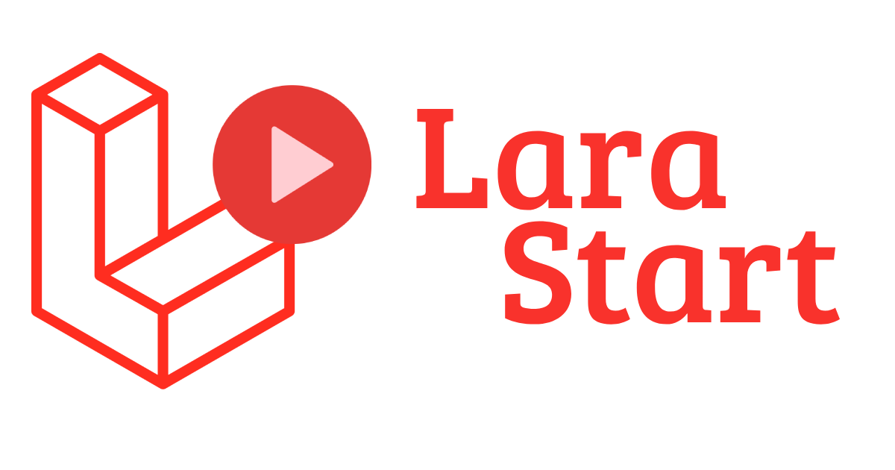

---

---

**Versão Laravel: 9.x**

**Versão AdminLTE: 3.2.0**

---

# Sobre

LaraStart é sua ferramenta para iniciar um novo projeto. Ele contém os recursos mais importantes e necessários para iniciar um novo projeto.

---

# **!!! Atenção !!!**

Se você encontrar algum problema de segurança, entre em contato comigo em juniorgelbcke@gmail.com

**Por favor, não abra um "Issue"**

---

# Feito e á Fazer

-   [x] Autenticação do usuário

-   [x] Chave primária padrão do usuário como UUID

-   [x] Sessão única para usuários

-   [x] Opção para desativar o acesso do usuário

-   [x] Autenticação 2FA com Google Authenticator/Authy _(Ativado pelo usuário)_

-   [x] Bloqueio automático do sistema por inatividade _(Ativado pelo usuário)_

-   [x] Backend com AdminLTE 3.2.0

-   [x] Vários temas

-   [x] Selecionador de idioma

-   [x] Sistema de Log

-   [x] Configurações do sistema (moeda, fuso horário, formato de data e hora)

-   [x] Permissão de grupos e funções

-   [ ] Autenticação 2FA com e-mail

-   [ ] Bate-papo interno

-   [ ] Caixa de Correio (Caixa de Entrada, Escrita e Leitura)

-   [ ] Tradução para alemão, francês e espanhol

---

# Configurando

---

1. Execute `git clone https://github.com/gelbcke/larastart.git`

2. Vá até a pasta do projeto
    - `cd /var/www/html/lara_start`
3. Da pasta raiz do projeto, execute
    - `sudo cp .env.example .env`
4. Configure seu arquivo `.env`
5. Da pasta raiz do projeto, execute

    - `composer install`
    - `php artisan key:generate`
    - `php artisan migrate`
    - `php artisan db:seed`
    - `php artisan storage:link`
    - `composer dump-autoload`

6. Defina as permissões de pastas e arquivos

    - `sudo chmod -R 777 ./`
    - `sudo chown -R www-data:www-data ./`
    - `sudo find ./ -type f -exec chmod 644 {} \;`
    - `sudo find ./ -type d -exec chmod 755 {} \;`
    - `sudo chgrp -R www-data storage bootstrap/cache`
    - `sudo chmod -R ug+rwx storage bootstrap/cache`
    - `sudo chmod -R 777 ./bootstrap/cache/`

---

# Credenciais do SEED

> -   User: admin@larastart.com
> -   Password: secret
